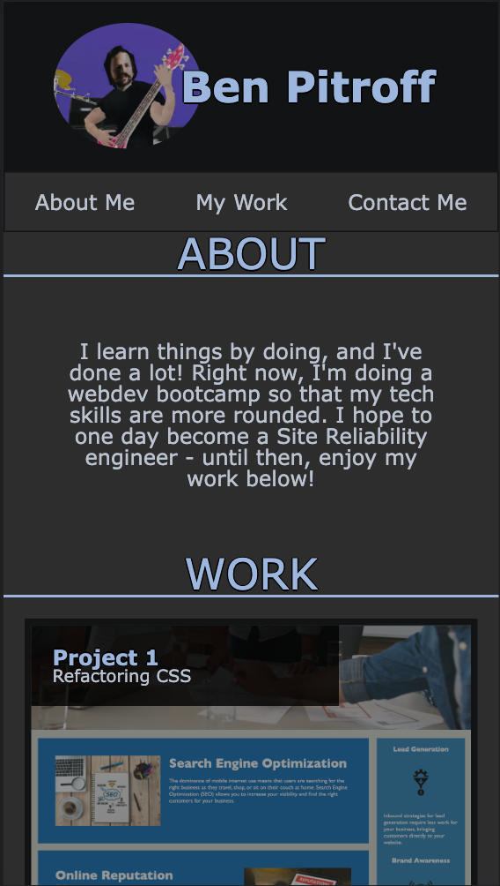

# bootcamp-portfolio
My portfolio for this coding bootcamp. This allowed me to practice utilizing a wireframe to plan out how the different sections and blocks would eventually fit into one another. I then spent numerous hours learning and fiddiling with CSS until it looked "okay". I then started over, put mobile-first as priority, and came up with what you see here.

[Follow this link to see the live page](https://chicken1991.github.io/bootcamp-portfolio/).

-Created by Ben Pitroff-